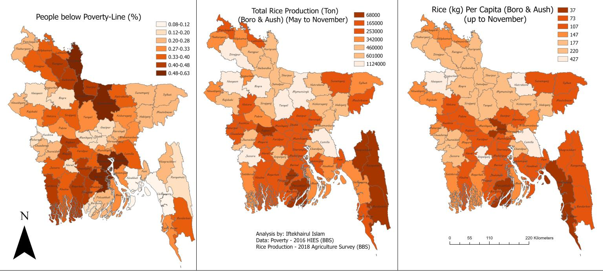

### As the countrywide lockdown continues with no light at the end of the tunnel, what should be the priority in dispatching relief (rice) to different districts? The number of the total population, poverty level, expected rice production (absolute), or reserve per capita? My humble suggestion would be preference should be given where rice production per capita is low irrespective of the poverty level or absolute level of production. Trying to come up with a comparative visualization on the priorities. Please note that relevant data are extracted from the 2016 Household Income and Expenditure Survey (HIES) and the 2018 Agriculture Survey conducted by BBS. For rice production estimation, I have considered only Boro and Aush harvest (from May to November) as it’s still a long way for Aman yield (December). I suppose the percentages (production, poor people) haven’t changed much in the last few years.
P.S. The recommendation made here is not an end policy suggestion per se. It can be taken as an 'agenda-setting' initiative
####                                  [A comparative picture of different factors]

